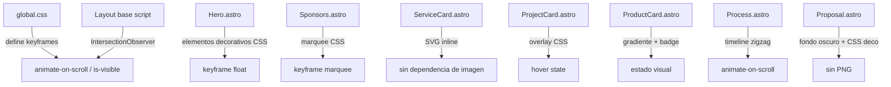

# Design Document: UI Improvements — Pimenta Studio

## Overview

Este documento describe el diseño técnico para las 8 mejoras visuales del sitio web de Pimenta Studio. El stack es Astro + TailwindCSS + CSS puro + vanilla JS inline en Astro, sin frameworks JS adicionales.

Las mejoras se agrupan en tres categorías:
- **Animaciones y comportamiento**: Hero decorativo, ScrollObserver, Sponsors marquee
- **Rediseño de secciones**: Process timeline, Proposal dark CTA
- **Mejoras de componentes**: ServiceCard SVG, ProjectCard overlay, ProductCard visual

Todos los cambios son aditivos o de reemplazo directo dentro de los archivos `.astro` existentes. No se crean nuevas dependencias npm.

---

## Architecture

El sitio sigue la arquitectura de Astro con componentes `.astro` que emiten HTML estático. Las animaciones se implementan en tres capas:

```
src/styles/global.css          ← keyframes globales, clases utilitarias de animación
src/components/sections/*.astro ← secciones que usan los componentes
src/components/ui/*.astro       ← componentes UI modificados
```

El ScrollObserver se implementa como un `<script>` inline en `global.css` o en el layout base, ejecutándose una vez al cargar la página y re-ejecutándose en `astro:after-swap` para compatibilidad con View Transitions.



---

## Components and Interfaces

### 1. Hero.astro — Elementos decorativos CSS

Reemplaza `<Image src={HeroIlust}>` por un contenedor con formas CSS absolutas.

**Estructura del lado derecho del Hero:**
```html
<div class="hero-deco" aria-hidden="true">
  <div class="hero-deco__circle hero-deco__circle--lg"></div>
  <div class="hero-deco__circle hero-deco__circle--sm"></div>
  <div class="hero-deco__dots"></div>
  <div class="hero-deco__gradient"></div>
</div>
```

- `hero-deco__circle--lg`: círculo grande con borde naranja, animación `float-slow`
- `hero-deco__circle--sm`: círculo pequeño relleno naranja, animación `float-fast`
- `hero-deco__dots`: patrón de puntos con `radial-gradient` repetido
- `hero-deco__gradient`: gradiente radial de fondo `#ff9327` → transparente
- Todos los elementos tienen `aria-hidden="true"` para no interferir con lectores de pantalla
- En mobile (`< 640px`): el contenedor tiene `opacity: 0.3` y `pointer-events: none`

**Animación de entrada:** clase `hero-deco--enter` con `animation: fadeScaleIn 800ms ease-out forwards`

---

### 2. ScrollObserver — Intersection Observer global

Script inline en el layout base (`src/layouts/Layout.astro` o equivalente).

**API pública (clases CSS):**
- `animate-on-scroll`: marca un elemento para observar
- `is-visible`: clase añadida por el observer cuando el elemento entra al viewport
- `data-stagger-container`: atributo en contenedores grid para activar stagger entre hijos

**Lógica:**
```js
// Threshold: 0.15
// rootMargin: '0px 0px -50px 0px'
// Una vez visible, se desconecta el observer del elemento (no re-anima)
// Stagger: delay = index * 100ms aplicado como style.transitionDelay
```

**Degradación elegante:** si `IntersectionObserver` no existe en `window`, se añade `is-visible` a todos los elementos `animate-on-scroll` inmediatamente.

**CSS base en global.css:**
```css
.animate-on-scroll {
  opacity: 0;
  transform: translateY(20px);
  transition: opacity 500ms ease-out, transform 500ms ease-out;
}
.animate-on-scroll.is-visible {
  opacity: 1;
  transform: translateY(0);
}
@media (prefers-reduced-motion: reduce) {
  .animate-on-scroll {
    opacity: 1;
    transform: none;
    transition: none;
  }
}
```

---

### 3. Process.astro — Timeline vertical zigzag

Reemplaza `<Accordion />` por un componente `<ProcessTimeline />` o markup inline.

**Estructura HTML:**
```html
<div class="process-timeline">
  <!-- Línea central vertical (visible en md+) -->
  <div class="process-timeline__line" aria-hidden="true"></div>

  <!-- Cada paso -->
  <div class="process-step process-step--left animate-on-scroll" data-index="1">
    <div class="process-step__number">01</div>
    <div class="process-step__card">
      <h3>Consulta Inicial</h3>
      <p>...</p>
    </div>
    <div class="process-step__dot" aria-hidden="true"></div>
  </div>

  <div class="process-step process-step--right animate-on-scroll" data-index="2">
    ...
  </div>
</div>
```

**Layout:**
- Mobile (`< 768px`): columna única, línea a la izquierda, todos los pasos alineados a la derecha de la línea
- Desktop (`≥ 768px`): pasos impares a la izquierda, pares a la derecha, línea central con punto conector

**Clases Tailwind principales:**
- Contenedor: `relative max-w-4xl mx-auto`
- Línea: `absolute left-1/2 top-0 bottom-0 w-0.5 bg-dark/20 hidden md:block`
- Número: `text-6xl font-medium text-accent/30`
- Card: `bg-gray rounded-[30px] p-8 border border-dark/10 shadow-sm`

---

### 4. ServiceCard.astro — SVG inline por servicio

Reemplaza `<Image src={img}>` por un slot de SVG inline pasado como prop o definido internamente.

**Mapeo de servicios a SVG:**

| Índice | Servicio | SVG (descripción) |
|--------|----------|-------------------|
| 1 | Desarrollo Web | `<code>` / ventana de browser |
| 2 | Marketing Digital | megáfono / gráfico de barras |
| 3 | Diseño & Branding | pincel / paleta |
| 4 | SEO & Posicionamiento | lupa / gráfico ascendente |
| 5 | Software a Medida | engranaje / terminal |
| 6 | Consultoría Estratégica | bombilla / diagrama |

Los SVG se definen como fragmentos inline dentro de `ServiceCard.astro` usando un objeto de mapeo por índice. Cada SVG tiene `width="80" height="80"` y usa `currentColor` para adaptarse al esquema de color de la tarjeta.

**Hover scale:**
```css
/* En ServiceCard.astro <style> */
.service-card-inner {
  transition: transform 200ms ease-out;
}
.service-card-inner:hover {
  transform: scale(1.02);
}
```

---

### 5. ProjectCard.astro — Overlay gradiente en hover

Modifica el contenedor de imagen para incluir un overlay absoluto.

**Estructura:**
```html
<div class="project-card__image-wrapper">
  
  <!-- Overlay -->
  <div class="project-card__overlay" aria-hidden="true"></div>
  <!-- Enlace sobre overlay -->
  <a href={`/portfolio/${slug}`} class="project-card__cta">
    Ver Proyecto →
  </a>
</div>
```

**CSS:**
```css
.project-card__image-wrapper {
  position: relative;
  overflow: hidden;
}
.project-card__img {
  transition: transform 300ms ease-out;
}
.project-card__image-wrapper:hover .project-card__img {
  transform: scale(1.05);
}
.project-card__overlay {
  position: absolute; inset: 0;
  background: linear-gradient(to top, rgba(0,0,0,0.7), transparent);
  opacity: 0;
  transition: opacity 300ms ease-out;
}
.project-card__image-wrapper:hover .project-card__overlay {
  opacity: 1;
}
.project-card__cta {
  position: absolute; bottom: 1rem; left: 1rem;
  color: white; opacity: 0;
  transition: opacity 300ms ease-out;
}
.project-card__image-wrapper:hover .project-card__cta {
  opacity: 1;
}
```

**Placeholder sin imagen:** `background: linear-gradient(135deg, var(--accent), var(--dark))`

---

### 6. ProductCard.astro — Gradiente y badge mejorado

**Cambios:**
- Área del icono: `background: linear-gradient(to bottom, #fff7ed, #ffffff)` para Disponible/Beta
- Área del icono con estado Próximamente: `opacity: 0.6`
- Badge: clases `text-xs font-medium px-2.5 py-1 rounded-full` (ya existentes, se ajustan colores)
- Sombra: `shadow-sm hover:shadow-md transition-shadow duration-200`

**Colores de badge por estado:**

| Estado | Fondo | Texto | Borde |
|--------|-------|-------|-------|
| Disponible | `#fff3e0` | `#b85c00` | `var(--accent)` |
| Beta | `#fef9c3` | `#854d0e` | `#fbbf24` |
| Próximamente | `#f3f4f6` | `#6b7280` | `#d1d5db` |

---

### 7. Sponsors.astro — Marquee CSS infinito

**Estructura:**
```html
<div class="sponsors-marquee-wrapper">
  <div class="sponsors-marquee" aria-label="Tecnologías que usamos">
    <!-- Track duplicado para loop continuo -->
    <div class="sponsors-track" aria-hidden="false">
      {logos originales}
    </div>
    <div class="sponsors-track" aria-hidden="true">
      {logos duplicados}
    </div>
  </div>
</div>
```

**CSS:**
```css
:root {
  --marquee-duration: 30s;
}
.sponsors-marquee-wrapper {
  overflow: hidden;
}
.sponsors-marquee {
  display: flex;
  width: max-content;
  animation: marquee var(--marquee-duration) linear infinite;
}
.sponsors-track {
  display: flex;
  align-items: center;
  gap: 3rem;
  padding: 1rem 1.5rem;
}
@keyframes marquee {
  from { transform: translateX(0); }
  to { transform: translateX(-50%); }
}
@media (prefers-reduced-motion: reduce) {
  .sponsors-marquee {
    animation: none;
    flex-wrap: wrap;
    width: auto;
    justify-content: center;
  }
  .sponsors-track[aria-hidden="true"] {
    display: none;
  }
}
```

El `translateX(-50%)` funciona porque el track duplicado hace que el contenido total sea el doble del original, y al mover -50% se vuelve al inicio visualmente.

---

### 8. Proposal.astro — Fondo oscuro con decoración CSS

**Estructura:**
```html
<div class="proposal-cta">
  <!-- Decoración de fondo -->
  <div class="proposal-cta__deco" aria-hidden="true">
    <div class="proposal-cta__orb proposal-cta__orb--1"></div>
    <div class="proposal-cta__orb proposal-cta__orb--2"></div>
    <div class="proposal-cta__grid"></div>
  </div>

  <!-- Contenido -->
  <div class="proposal-cta__content">
    <h2>Hagamos que las cosas pasen</h2>
    <p>...</p>
    <button class="btn-proposal">Agendar Reunión</button>
  </div>

  <!-- Elemento visual derecho (CSS puro) -->
  <div class="proposal-cta__visual" aria-hidden="true">
    <div class="proposal-cta__ring proposal-cta__ring--outer"></div>
    <div class="proposal-cta__ring proposal-cta__ring--inner"></div>
    <div class="proposal-cta__dot"></div>
  </div>
</div>
```

**CSS clave:**
```css
.proposal-cta {
  background: var(--dark);
  color: var(--white);
  position: relative;
  overflow: hidden;
  border-radius: 45px;
}
.proposal-cta__orb--1 {
  position: absolute; top: -20%; right: 10%;
  width: 400px; height: 400px; border-radius: 50%;
  background: radial-gradient(circle, rgba(255,147,39,0.15), transparent 70%);
}
.proposal-cta__orb--2 {
  position: absolute; bottom: -30%; left: 5%;
  width: 300px; height: 300px; border-radius: 50%;
  background: radial-gradient(circle, rgba(255,147,39,0.08), transparent 70%);
}
.btn-proposal {
  background: var(--accent);
  color: var(--dark);
  transition: background 200ms ease-out, color 200ms ease-out;
}
.btn-proposal:hover {
  background: var(--white);
  color: var(--dark);
}
```

---

## Data Models

No se introducen nuevos modelos de datos. Los cambios son puramente de presentación.

**Variables CSS nuevas en `:root`:**
```css
--marquee-duration: 30s;
--scroll-anim-duration: 500ms;
--scroll-anim-easing: ease-out;
--scroll-anim-distance: 20px;
```

**Atributos HTML nuevos:**
- `data-stagger-container`: en contenedores grid para activar stagger del ScrollObserver
- `aria-hidden="true"`: en todos los elementos puramente decorativos

---

## Correctness Properties

*A property is a characteristic or behavior that should hold true across all valid executions of a system — essentially, a formal statement about what the system should do. Properties serve as the bridge between human-readable specifications and machine-verifiable correctness guarantees.*

### Property 1: ScrollObserver agrega is-visible a elementos visibles

*For any* elemento con clase `animate-on-scroll` que entre en el viewport con al menos 15% de visibilidad, el ScrollObserver debe agregar la clase `is-visible` a ese elemento.

**Validates: Requirements 2.1, 2.2**

---

### Property 2: Stagger delay es proporcional al índice

*For any* contenedor con atributo `data-stagger-container` que tenga N hijos con clase `animate-on-scroll`, el `transitionDelay` del hijo en posición i debe ser igual a `i * 100ms`.

**Validates: Requirements 2.6**

---

### Property 3: SVG inline presente en cada ServiceCard

*For any* ServiceCard renderizada con un índice de servicio válido (1–6), el DOM resultante debe contener exactamente un elemento `<svg>` inline dentro del área de imagen, y ningún elemento `` con extensión `.png` en esa área.

**Validates: Requirements 4.1, 4.2**

---

### Property 4: Esquema de color de ServiceCard corresponde al índice

*For any* ServiceCard con índice 1, la clase de fondo debe ser `bg-gray`; con índice 2, `bg-green`; con índice ≥ 3, `bg-dark`. Esta regla debe mantenerse independientemente del contenido del SVG o del título.

**Validates: Requirements 4.3**

---

### Property 5: Estilo visual de ProductCard corresponde al estado

*For any* ProductCard, el estilo del área del icono y del badge debe corresponder al estado del producto: estado "Disponible" o "Beta" → gradiente de fondo en área del icono y badge con color de acento; estado "Próximamente" → opacidad 0.6 en área del icono y badge en gris.

**Validates: Requirements 6.1, 6.3, 6.4**

---

### Property 6: Sponsors duplica logos para loop continuo

*For any* conjunto de N logos en Sponsors, el DOM debe contener exactamente 2N elementos de logo (N originales + N duplicados con `aria-hidden="true"`) para garantizar el loop sin saltos.

**Validates: Requirements 7.2**

---

## Error Handling

| Escenario | Comportamiento esperado |
|-----------|------------------------|
| `IntersectionObserver` no disponible | Todos los elementos `animate-on-scroll` reciben `is-visible` inmediatamente al cargar |
| Imagen de ProjectCard no disponible | El contenedor muestra un gradiente de marca (`--accent` → `--dark`) como placeholder |
| `prefers-reduced-motion: reduce` | Animaciones CSS desactivadas; marquee de Sponsors muestra grid estático; `animate-on-scroll` muestra elementos visibles sin transición |
| SVG inline malformado | El navegador renderiza el área vacía; el layout de la tarjeta no se rompe gracias al tamaño fijo del contenedor |

---

## Testing Strategy

### Dual Testing Approach

Se usa una combinación de **unit tests** (ejemplos específicos y casos borde) y **property-based tests** (propiedades universales).

**Herramienta de property-based testing:** [fast-check](https://github.com/dubzzz/fast-check) (compatible con Vitest, sin dependencias de framework UI).

### Unit Tests (ejemplos y casos borde)

- Hero: verificar que no existe `` en el DOM y que existen ≥ 2 elementos con clase `hero-deco__circle`
- Hero: verificar que los botones CTA con texto "Agendar Reunión" y "Ver Portfolio" existen
- ScrollObserver: verificar que elementos sin `IntersectionObserver` reciben `is-visible` inmediatamente (edge case 2.5)
- Process: verificar que los 4 títulos de pasos existen en el DOM y que no existe ningún `.accordion__item`
- ProjectCard: verificar que el overlay tiene `background: linear-gradient(...)` en su CSS
- ProductCard: verificar que el badge tiene clases `rounded-full` y `text-xs`
- Sponsors: verificar que el contenedor tiene `overflow: hidden` y que la animación `marquee` está definida
- Sponsors: verificar que existe `@media (prefers-reduced-motion: reduce)` que desactiva la animación (edge case 7.4)
- Proposal: verificar que no existe `` y que el fondo es `var(--dark)`

### Property-Based Tests

Cada test debe ejecutarse con **mínimo 100 iteraciones**. Cada test referencia su propiedad del diseño con el tag:
`// Feature: ui-improvements, Property N: <texto>`

**Property 1 — ScrollObserver agrega is-visible:**
```js
// Feature: ui-improvements, Property 1: ScrollObserver agrega is-visible a elementos visibles
fc.assert(fc.property(
  fc.array(fc.record({ id: fc.string(), visible: fc.boolean() }), { minLength: 1 }),
  (elements) => {
    // Simular observer: para cada elemento que entra al viewport (visible=true),
    // verificar que se le agrega la clase is-visible
    const result = simulateScrollObserver(elements);
    return elements
      .filter(e => e.visible)
      .every(e => result.find(r => r.id === e.id)?.hasClass('is-visible'));
  }
), { numRuns: 100 });
```

**Property 2 — Stagger delay proporcional al índice:**
```js
// Feature: ui-improvements, Property 2: Stagger delay es proporcional al índice
fc.assert(fc.property(
  fc.integer({ min: 2, max: 10 }),
  (n) => {
    const delays = computeStaggerDelays(n);
    return delays.every((delay, i) => delay === i * 100);
  }
), { numRuns: 100 });
```

**Property 3 — SVG inline en ServiceCard:**
```js
// Feature: ui-improvements, Property 3: SVG inline presente en cada ServiceCard
fc.assert(fc.property(
  fc.integer({ min: 1, max: 6 }),
  (index) => {
    const html = renderServiceCard({ index });
    const hasSvg = html.includes('<svg');
    const hasPng = /]+\.png/.test(html);
    return hasSvg && !hasPng;
  }
), { numRuns: 100 });
```

**Property 4 — Esquema de color de ServiceCard:**
```js
// Feature: ui-improvements, Property 4: Esquema de color corresponde al índice
fc.assert(fc.property(
  fc.integer({ min: 1, max: 10 }),
  (index) => {
    const html = renderServiceCard({ index });
    if (index === 1) return html.includes('bg-gray');
    if (index === 2) return html.includes('bg-green');
    return html.includes('bg-dark');
  }
), { numRuns: 100 });
```

**Property 5 — Estilo de ProductCard por estado:**
```js
// Feature: ui-improvements, Property 5: Estilo visual de ProductCard corresponde al estado
fc.assert(fc.property(
  fc.constantFrom('Disponible', 'Beta', 'Próximamente'),
  (status) => {
    const html = renderProductCard({ status, name: 'Test', description: 'Desc' });
    if (status === 'Disponible' || status === 'Beta') {
      return html.includes('fff7ed') && !html.includes('opacity-60');
    }
    return html.includes('opacity-60') || html.includes('opacity: 0.6');
  }
), { numRuns: 100 });
```

**Property 6 — Sponsors duplica logos:**
```js
// Feature: ui-improvements, Property 6: Sponsors duplica logos para loop continuo
fc.assert(fc.property(
  fc.array(fc.string(), { minLength: 1, maxLength: 12 }),
  (logos) => {
    const html = renderSponsors({ logos });
    const visibleCount = countElements(html, '[aria-hidden="false"] .sponsor-logo');
    const hiddenCount = countElements(html, '[aria-hidden="true"] .sponsor-logo');
    return visibleCount === logos.length && hiddenCount === logos.length;
  }
), { numRuns: 100 });
```

### Cobertura esperada

- Unit tests: casos borde, verificación de estructura DOM, CSS crítico
- Property tests: comportamiento universal del ScrollObserver, stagger, ServiceCard, ProductCard, Sponsors
- Juntos cubren todos los acceptance criteria testeables (2.1, 2.2, 2.3, 2.4, 2.6, 4.1, 4.2, 4.3, 6.1, 6.3, 6.4, 7.2)
